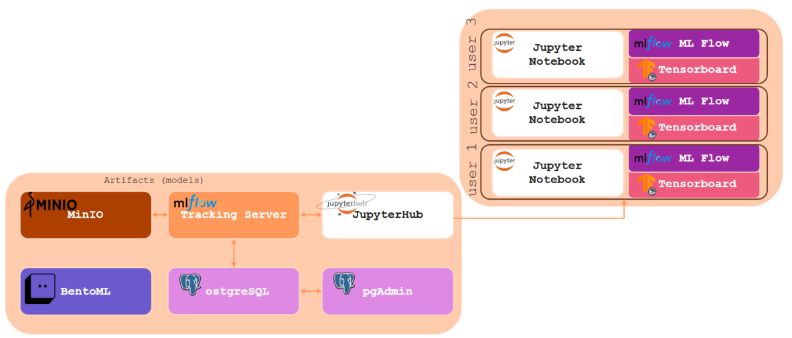

# EnerTEF AI Experimental Workbench

## Overview

The EnerTEF JupyterHub ML Platform is a containerized machine learning environment built on Kubernetes. It provides isolated Jupyter notebook servers for each user, integrated with experiment tracking, visualization, and storage services.

The platform includes:
- JupyterHub for multi-user notebook management
- TensorBoard for training visualization
- MLflow for experiment tracking and model management
- MinIO for S3-compatible object storage
- PostgreSQL database with pgAdmin interface

## Architecture



### Data Flow
1. Users access JupyterHub via web interface
2. Each user gets a dedicated Kubernetes pod with Jupyter notebook
3. ML tools (TensorBoard, MLflow) run as integrated extensions
4. Data persists in MinIO and PostgreSQL
5. All services communicate through Kubernetes networking

## Components

### JupyterHub
Multi-user platform that provisions isolated Jupyter notebook environments. Each user receives a dedicated container with pre-configured tools and libraries.

### TensorBoard
Visualization tool for machine learning experiments. Integrated directly into notebook environment for real-time monitoring of training metrics, loss curves, and model performance.

### MLflow
Experiment tracking and model management platform. Provides:
- Parameter and metric logging
- Model versioning and storage
- Experiment comparison
- User-based isolation (group isolation not implemented)

### MinIO
S3-compatible object storage for datasets, model artifacts, and logs. Accessible from notebooks for data management and persistence.

### PostgreSQL & pgAdmin
- PostgreSQL: Primary database for MLflow metadata and persistent data
- pgAdmin: Web-based database administration interface

### Kubernetes
Container orchestration platform managing all services, networking, and resource allocation. Uses k3d for local development environments.

## Directory Structure

### `/kubernetes/` - Infrastructure Configuration
Contains Kubernetes manifests and deployment scripts:
- `start.sh` / `stop.sh`: Environment startup and shutdown scripts
- `db/`: PostgreSQL deployment, persistent volume claims, and secrets
- `minio/`: MinIO storage service configuration
- `mlflow-secret/`: MLflow authentication and network policies
- `values/`: Helm chart values for JupyterHub, MinIO, and other services
  - `jupyterhub.yaml`: JupyterHub Helm chart configuration
  - `minio-tenant.yaml`: MinIO tenant configuration
  - `pgadmin.yaml`: pgAdmin Helm chart configuration


### `/notebook-scripts/` - User Environment Templates
Files automatically copied to new user home directories:
- `requirements.txt`: Python dependencies for notebooks
- `tensorboard_logger.py`: TensorBoard logging utilities
- `mlflow_group_utils.py`: MLflow user management utilities
- Example notebooks for common workflows

### `/jn-tb/` - Container Images
Custom Docker images for the platform:
- `Dockerfile`: Base Jupyter notebook image
- `mlflow.Dockerfile`: MLflow server image
- `start-notebook.sh`: Notebook initialization script
- `mlflow-extension/`: Jupyter extensions for MLflow integration

## Setup and Deployment

### Prerequisites

- Docker
  - Docker version 28.2.2 or later
    For official installation instructions, visit:
    https://docs.docker.com/engine/install/ubuntu/

- Kubernetes tools:
  - kubectl v1.33.2 or later
  For official installation instructions, visit:
  https://kubernetes.io/docs/tasks/tools/install-kubectl-linux/
  ```bash
  # Install kubectl
  curl -LO "https://dl.k8s.io/release/v1.33.2/bin/linux/amd64/kubectl"
  sudo install -o root -g root -m 0755 kubectl /usr/local/bin/kubectl
  ```

  
  - k3d v5.8.3 or later (with k3s v1.31.5-k3s1)
  For official installation instuctions, visit:
  https://k3d.io/stable/#releases
  ```bash
  # Install k3d
  curl -s https://raw.githubusercontent.com/k3d-io/k3d/main/install.sh | bash
  ```


- Helm v3.18.3 or later
  For official installation instuctions, visit:
  https://helm.sh/docs/intro/install/
  ```bash
  # Install Helm
  curl -fsSL -o get_helm.sh https://raw.githubusercontent.com/helm/helm/main/scripts/get-helm-3
  chmod 700 get_helm.sh
  ./get_helm.sh
  ```

### Custom Images (Built Locally)

- **jn-mlflow**: Built from `/jn-tb/mlflow.Dockerfile` using the start script - contains Jupyter Notebook with MLflow integration

### Deployment Steps

1. Clone repository and navigate to kubernetes directory:
```bash
git clone <repository-url>
cd enertef_hazem/kubernetes/
```

2. Start the environment:
```bash
./start.sh
```

This creates a k3d cluster, builds Docker images, and deploys all services.

3. Access services via port forwarding:
- JupyterHub: http://localhost:8080
- MinIO Console: http://localhost:9001
  username: minio_user
  password: minio_pwd
- pgAdmin: http://localhost:5050
  username: admin@admin.com
  password: admin

4. Stop the environment:
```bash
./stop.sh
```

## Usage Workflow

### Basic Workflow

1. Log into JupyterHub at http://localhost:8080
2. Create username and launch notebook server:
    - Use only alphanumeric characters (letters and numbers)
    - Username is case insensitive
3. Access pre-installed libraries and scripts in the `/notebook-scripts/` directory

### MLflow Experiment Tracking

```python
import mlflow

# Set experiment name
mlflow.set_experiment("experiment_name")

# Log parameters, metrics, and artifacts
with mlflow.start_run():
    mlflow.log_param("learning_rate", 0.01)
    mlflow.log_metric("accuracy", 0.95)
    mlflow.log_artifact("model.pkl")
```

### TensorBoard Visualization

```python
from tensorboard_logger import TensorBoardLogger

logger = TensorBoardLogger()
# Use logger to track training metrics
```
## Port Mappings

The platform exposes several services on the following ports:

| Service               | Port  | Description                               |
|-----------------------|-------|-------------------------------------------|
| Registry              | 5001  | Docker registry for custom images         |
| JupyterHub            | 8080  | Web interface for notebook access         |
| JupyterHub Internal   | 8081  | Hub's internal service port               |
| MinIO                 | 9000  | S3-compatible object storage API          |
| MinIO Console         | 9001  | Web interface for MinIO management        |
| PostgreSQL            | 5432  | Database connection port                  |
| pgAdmin               | 5050  | Web interface for database management     |

Additionally, ports 80 and 9090 have to be opened for Kubernetes services and internal routing to work. 
This is done by the start script.

Access these services by visiting `http://localhost:<PORT>` in your web browser.


**Note:** Not all services and ports are designed for web access. Some are exposed for API access, internal services, or diagnostics purposes only. These include:
- Registry port (5001) - Used for Docker image storage
- MinIO API port (9000) - For S3 API access
- PostgreSQL port (5432) - For direct database connections
- JupyterHub internal ports - For service communications

These ports are exposed to allow direct connections when needed for development, debugging, or custom integrations.

## Advanced Features

### MLflow User Isolation
- Each user has isolated experiment tracking
- User-specific database schemas prevent data mixing
- Group-based isolation not currently implemented

### Integrated Extensions
- MLflow and TensorBoard accessible directly from notebooks
- Automatic startup with notebook environment
- Seamless integration without additional configuration


## Storage Usage

Each user receives a dedicated PersistentVolumeClaim (PVC) for their notebook data, typically **10Gi** per user. Shared services (PostgreSQL, MinIO, pgAdmin, etc.) each have their own PVCs (usually 1Gi each).

| PVC Name                   | Namespace      | Capacity | Purpose/Usage                                                                 |
|----------------------------|---------------|----------|-------------------------------------------------------------------------------|
| **claim-username**       | default       | 10Gi     | User notebook storage (home directory, notebooks, outputs, etc.)              |
| **db-data**                | default       | 1Gi      | Persistent storage for the PostgreSQL database (MLflow metadata, etc.)        |
| **hub-db-dir**             | default       | 1Gi      | JupyterHub’s own database (user/session state, authentication, etc.)          |
| **pgadmin-pgadmin4**       | default       | 1Gi      | Persistent storage for pgAdmin (database admin UI settings, configs, etc.)    |
| **data0-myminio-pool-0-0** | minio-tenant  | 1Gi      | Persistent storage for MinIO (S3-compatible object storage for artifacts/data) |

### How to Modify Storage Sizes

To change the amount of storage allocated to each component, edit the following files:

#### User Notebooks (10Gi default)
File: [`kubernetes/values/jupyterhub.yaml`](kubernetes/values/jupyterhub.yaml)
```yaml
singleuser:
  storage:
    capacity: 10Gi  # Change this value
```

#### JupyterHub Database (1Gi default)
File: [`kubernetes/values/jupyterhub.yaml`](kubernetes/values/jupyterhub.yaml)
```yaml
hub:
  db:
    pvc:
      storage: 1Gi  # Change this value
```

#### pgAdmin Storage (1Gi default)
File: [`kubernetes/values/pgadmin.yaml`](kubernetes/values/pgadmin.yaml)
```yaml
persistentVolume:
  size: 1Gi  # Change this value
```

#### PostgreSQL Database (1Gi default)
File: [`kubernetes/db/db-pvc.yaml`](kubernetes/db/db-pvc.yaml)
```yaml
resources:
  requests:
    storage: 1Gi  # Change this value
```

#### MinIO Object Storage (1Gi default)
File: [`kubernetes/minio/minio-pvc.yaml`](kubernetes/minio/minio-pvc.yaml)
```yaml
resources:
  requests:
    storage: 1Gi  # Change this value
```


## Troubleshooting

### Service Access Issues
- Verify port forwarding is active
- Check pod status: `kubectl get pods`
- Restart port forwarding if needed

### Notebook Startup Problems
- Check pod status: `kubectl get pods`
- View pod logs: `kubectl logs <pod-name>`
- Verify resource availability

### MLflow Issues
- Confirm PostgreSQL is running: `kubectl get pods`
- Check MLflow server logs
- Verify database connectivity

### Useful Commands
```bash
# Check all pods
kubectl get pods --all-namespaces

# View pod logs
kubectl logs <pod-name>

# Check resource usage
kubectl top pods
```

## Development and Customization

### Adding User Scripts
- Place scripts that should be pre-loaded in `/notebook-scripts/`
- Update `requirements.txt` for new dependencies
- Scripts are automatically copied to user directories

### Environment Modifications
- Modify Dockerfiles in `/jn-tb/` for base images
- Update Helm values in `/kubernetes/values/`
- Add services via Kubernetes manifests

## Summary

This platform provides a complete ML development environment with user isolation, experiment tracking, and integrated tools. The containerized architecture ensures consistent environments while Kubernetes manages scaling and resource allocation.

The setup is suitable for both individual researchers and teams, with automatic provisioning of isolated notebook environments and shared services for collaboration.

## Further Reading

- [JupyterHub Documentation](https://jupyterhub.readthedocs.io/)
- [MLflow Documentation](https://mlflow.org/docs/latest/index.html)
- [TensorBoard Documentation](https://www.tensorflow.org/tensorboard)
- [MinIO Documentation](https://docs.min.io/community/minio-object-store/index.html)
- [Kubernetes Documentation](https://kubernetes.io/docs/)
