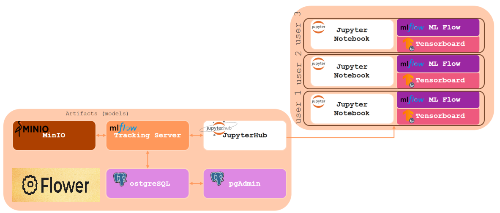
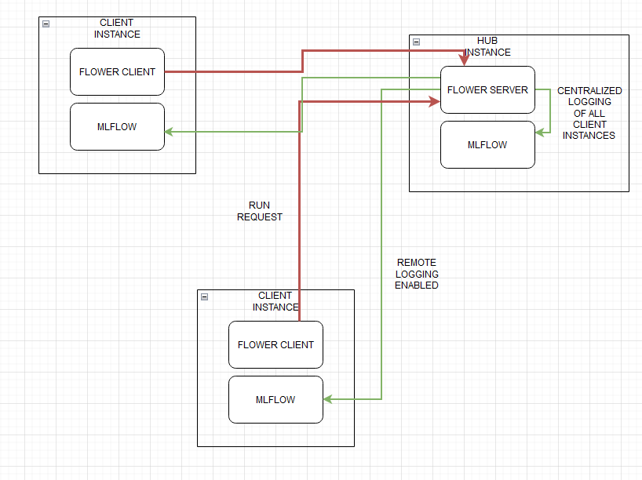

# EnerTEF JupyterHub ML Platform Documentation

## Overview

The EnerTEF JupyterHub ML Platform is a flexible ecosystem that provides users with utilities centered around Machine Learning tasks. 
This ecosystem is configurable to include:
- An isolated environment through a combination of containerization and **Jupyterhub**
- Namespaced Dataset, training and evaluation tracking with **Mlflow**
- Role based access controle, using **Keycloak** for authentication and matching that in Mlflow with Jupterhub hooks.
- **Tensorboard** for training visualization provided through Jupyterhub extensions. An extension is also provided for mlflow access.
- **Flower AI** for distributed learning strategies, and a query system that ties it to Mlflow to realize federated learning.

## Deployment 

**IMPORTANT**: To deploy the AI Workbench, a cluster is needed, preferably equipped with ingress and cert controllers. 
The submodule and helper scripts are provided for a setup that mimics production environment ( non self-signed certificates + ingress over host machine )
If you already have a properly configured cluster, jump to step 3

1. Install cluster manager of your choice, eg:
```bash
curl -sfL https://get.k3s.io | INSTALL_K3S_EXEC="server" sh -s - --flannel-backend none --token 12345
```
2. Install dependencies:
```bash
cd cluster-start
chmod +x cluster-create.sh && ./cluster-create.sh
chmod +x cluster-prepate.sh && ./cluster-prepare.sh
```

3. Clone repository and navigate to directory:
```bash
git clone --recurse-submodules <repository-url>
cd AI_Experiment_Workbench
```

4. Install chart ( change values beforehand if needed ):
```bash
helm upgrade --install mlfw -n mlfw --create-namespace ./mlflow-workbench -f mlflow-workbench/values.yaml
```

## Values
Postgres and Minio are there to be used by Mlflow. Only persistence and authentication should be configured in those charts.

### Authentication
The chart relies on Keycloak to manage Mlflow workspaces belonging to different users. Admin users have access to all workspaces, standard users have access to only their workspace.<br>
The mediator between Keycloak and Mlflow is Jupyterhub. It takes the user identity after successfull authentication, and creates Mlflow credentials at the container creation stage.<br>

If auth.external.enabled is false , the app deploys its own Keycloak using whats in the values block.<br>
The Keycloak deployed by the app comes preconfigured with one admin and one standard user.<br>
Use the Keycloak admin credentials to create other users:
```
kc_admin: "admin"
kc_admin_pass: "admin"
```

If auth.external.enabled is true, Jupyterhub will use the external Keycloak instance, that is assumed to be preconfigured with the values.<br>
The group_key is the OIDC attribute that dictates the user role in the Workbench.<br>
The allowed and admin groups are the exact mapping to standard and admin users respectively.<br>
```
external:
  enabled: false
  realm_url: "https://tef-dso-Keycloak.k8s.eonerc.rwth-aachen.de/realms/tef-dso"
  groups_key: "oauth_user.roles"
  allowed_groups:
    - mlfw-user
  admin_groups:
    - mlfw-admin
```

The client_id and client_secret are used for authentication between jupyterhub and Keycloak.<br>
Obtained by configuring a client app in Keycloak.<br>

```
client_id: "jhub-mlfw"
client_secret: ""
```

Skipping TLS verification is only useful in a local setup.<br> 

```
insecure_skip_verify: true
```


### Ingress
Access to the platform is configurable through Ingress and Gatways API.<br>
Reference your certificate issuer in the annotations to use TLS.<br>
```
annotations: {}
```

If using Gateways, a gateway is assumed to exist.<br>
```
gateway:
  default_gateway:
    name: eg
    namespace: envoy-gateway-system
    https_listener: https
```
No need for annotations in that case, as certification is defined at a Gateway level 
with the gateways API.<br>

### Flower
Flower is an optional service here. Disable with corresponding flag if needed.<br>
```
enabled: false
```

Applications are aware of a single Flower hub, that will receive tasks containing projects, and query other nodes about availability to run them.<br>
If running as hub, the fed Mlflow credentials are used by the hub Flower instance to log all federated learning operations into its Mlflow sidecar.<br>

```
as_hub: true
fed_username: mlflowfed
fed_password: mlflowfed123456
```
Certification is used for Flower node/server access controle through client certificates.<br>
This is preliminary until the app is changed to use Flower authentication.<br>
```
issuer_ref:
  name: step-issuer
  kind: StepClusterIssuer
  group: "certmanager.step.sm"
```
The dataset_tags block is preliminary. It represents a rule for when a node picks up a job.<br>
In this case, nodes broadcast tags of their datasets. When a job reaches the server,
which requires one of those datasets, its clientapp gets routed to the node.<br>

```
dataset_tags:
  - "test-tag-1"
  - "test-tag-2"
```

### Jupyterhub

Custom user images can be configured:

```
image:
  name: soullessblob/tensorflow-notebook
```
This is useful when using custom notebooks with specific dependencies.<br>
The image of user environment is simply a python image with some packages installed.<br>
To use custom notebooks , put them inside **mlflow-workbench/base-app**.<br>

## Usage


### Architecture
The architecture is split: Within a single instance of this application, and accross multiple instances of the application
The following is within a single instance:



If flower is enabled, the flower architecture becomes relevant:


[source](https://flower.ai)

The serverapp always ends up in the server, i.e, the superexec belonging to the superlink.<br> 
This allows to provisiong both the local admin mlflow credentials on the hub instance, and the remote , user specific mlflow credentials for the client instance.<br>
The serverapp then uses that to log into both mlflow tracking servers, allowing for proper namespaced and selective model sharing:



Centralized and remote logging is only possible from the serverapp, because the client app can run in any arbitrary supernode ( other client ), making the superlink the center point of the setup.<br>
An app deployed as hub will generate certificates, these should be passed to apps deployed as nodes/clients, that they may reach the superlink.

### User environment structure

Each user gets a dedicated Kubernetes pod with a preconfigured environment that includes<br>
1. Jupyter user environment
2. ML python packages ( tensorflow, scikit )
3. ML binaries/tools ( Flower )
4. Extensions to access the tools ( Tensorboard, Mlflow )

With the use of kubernetes, user environment is persisted between sessions, even when the pod goes down.<br>
Services can be further secured with NetworkPolicies, as they all rely on the cluster's networking.<br>
Custom NetworkPolicies can be added in the jhub-central values block.<br>

### Workflow
1. Log into JupyterHub at http://\<hostname\>:8080 using pre-configured users if no external Keycloak is provided(admin-/stander-user)
2. Access pre-installed libraries and scripts in the `/notebook-scripts/` directory

The user can rely on the predefined example notebooks or also create any python or notebook file they want.<br>
If flower is enabled, the project can be configured in the provided pyproject.toml, extra dependencies can be added,
and code needs to be restricted to client.py and server.py.<br>
This is preliminary, the ultimate goal is to wrap much simpler user defined functions in a Flower project template.<br>
For now the user can open the terminal extension and run
```
flwr run . --stream
```

they can also configure the sought after datasets in the pyproject.toml:

```
[tool.flwr.app.config]
dataset_tags="test-tag-1"
```

## Summary

### Components

#### JupyterHub
Multi-user platform that provisions isolated Jupyter notebook environments. Each user receives a dedicated container with pre-configured tools and libraries.

#### TensorBoard
Visualization tool for machine learning experiments. Integrated directly into notebook environment for real-time monitoring of training metrics, loss curves, and model performance.

#### MLflow
Experiment tracking and model management platform. Provides:
- Parameter and metric logging
- Model versioning and storage
- Experiment comparison
- User-based isolation (group isolation not implemented)

#### Flower AI
Federated learning/running of ML tasks. Flower breaks down every ML process into a client and server application. These are then deployed and ran selectively in arbitrary nodes. A clientapp usually contains the actual learning process. A serverapp aggregates from multiple of the same clientapp type. This level of customization allows us to weave MLFlow around flower.

#### Kubernetes
Container orchestration platform managing all services, networking, and resource allocation. Uses k3d for local development environments.

## Development and Customization

### Adding User Scripts
- Place scripts that should be pre-loaded in `base-app/`
- Update `requirements.txt` for new dependencies
- Scripts are automatically copied to user directories

### Environment Modifications
- Modify Dockerfiles in `images` for base images
- Update Helm values in `values.yaml`
- Add services via Kubernetes manifests

## Further Reading

- [JupyterHub Documentation](https://jupyterhub.readthedocs.io/)
- [MLflow Documentation](https://mlflow.org/docs/latest/index.html)
- [TensorBoard Documentation](https://www.tensorflow.org/tensorboard)
- [MinIO Documentation](https://docs.min.io/community/minio-object-store/index.html)
- [Kubernetes Documentation](https://kubernetes.io/docs/)