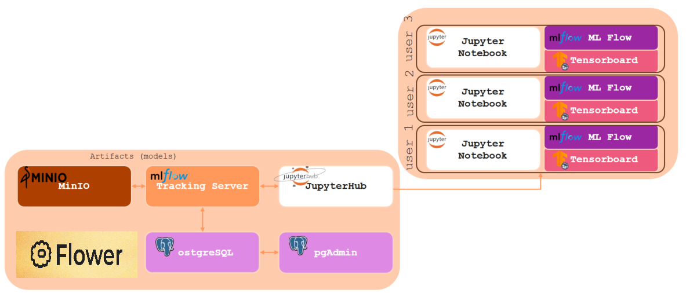
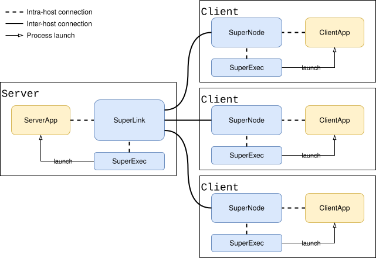
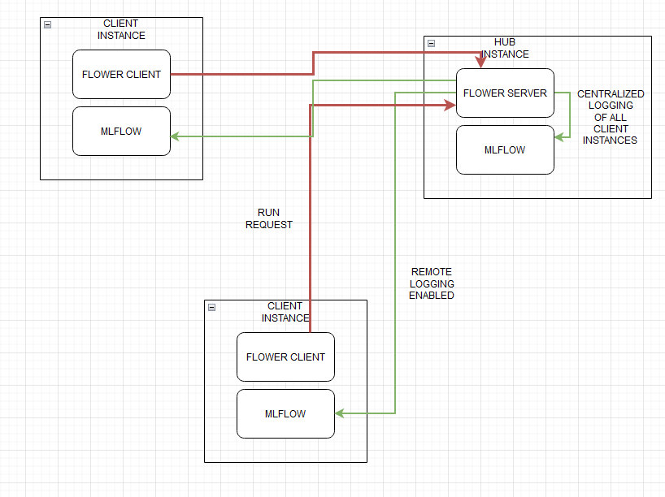

<!-- TOC start (generated with https://github.com/derlin/bitdowntoc) -->

- [EnerTEF JupyterHub ML Platform Documentation](#enertef-jupyterhub-ml-platform-documentation)
   * [Overview](#overview)
   * [Deployment ](#deployment)
      + [Cluster bootstrapping](#cluster-bootstrapping)
      + [Installation](#installation)
   * [Values](#values)
      + [Authentication](#authentication)
      + [Ingress](#ingress)
      + [Flower](#flower)
      + [Jupyterhub](#jupyterhub)
   * [Usage](#usage)
      + [Architecture](#architecture)
      + [User environment structure](#user-environment-structure)
      + [Workflow](#workflow)
   * [Summary](#summary)
      + [Components](#components)
         - [JupyterHub](#jupyterhub-1)
         - [TensorBoard](#tensorboard)
         - [MLflow](#mlflow)
         - [Flower AI](#flower-ai)
         - [Kubernetes](#kubernetes)
   * [Development and Customization](#development-and-customization)
      + [Adding User Scripts](#adding-user-scripts)
      + [Environment Modifications](#environment-modifications)
   * [Further Reading](#further-reading)
   * [Questions](#questions)

<!-- TOC end -->

<!-- TOC --><a name="enertef-jupyterhub-ml-platform-documentation"></a>
# EnerTEF JupyterHub ML Platform Documentation

<!-- TOC --><a name="overview"></a>
## Overview

The EnerTEF JupyterHub ML Platform is a flexible ecosystem that provides users with utilities centered around Machine Learning tasks. 
This ecosystem is configurable to include:
- An isolated environment through a combination of containerization and **Jupyterhub**
- Namespaced Dataset, training and evaluation tracking with **Mlflow**
- Role based access control, using **Keycloak** for authentication and matching that in Mlflow with Jupterhub hooks.
- **Tensorboard** for training visualization provided through Jupyterhub extensions. An extension is also provided for mlflow access.
- **Flower AI** for distributed learning strategies, and a query system that ties it to Mlflow to realize federated learning.

<!-- TOC --><a name="deployment"></a>
## Deployment 

<!-- TOC --><a name="cluster-bootstrapping"></a>
### Cluster bootstrapping
A detailed guide on cluster bootstrapping can be found under in the [cluster preparation docs](./docs/cluster-setup.md).

**IMPORTANT**: To deploy the AI Workbench, a cluster is needed, equipped with ingress and cert controllers. 
If you already have a properly configured cluster, jump to the next section.

<!-- TOC --><a name="installation"></a>
### Installation
1. Clone repository and navigate to directory:
```bash
git clone --recurse-submodules <repository-url>
cd AI_Experiment_Workbench
```

2. Install chart ( change values beforehand if needed ):
```bash
helm upgrade --install mlfw -n mlfw --create-namespace ./mlflow-workbench -f mlflow-workbench/values.yaml
```

<!-- TOC --><a name="values"></a>
## Values
Postgres and Minio are there to be used by Mlflow. Only persistence and authentication should be configured in those charts.

<!-- TOC --><a name="authentication"></a>
### Authentication
The chart relies on Keycloak to manage Mlflow workspaces belonging to different users. Admin users have access to all workspaces, standard users have access to only their workspace.<br>
The mediator between Keycloak and Mlflow is Jupyterhub. It takes the user identity after successfulauthentication, and creates Mlflow credentials at the container creation stage.<br>

If auth.external.enabled is false, a keycloak instance is deployed with a default realm and app client.<br>
The Keycloak deployed by the app comes preconfigured with one admin and one standard user.<br>
Use the Keycloak admin credentials to create other users:
```
kc_admin: "admin"
kc_admin_pass: "admin"
```

If auth.external.enabled is true, Jupyterhub will use the external Keycloak instance, that is assumed to be preconfigured with the values.<br>
The group_key is the OIDC attribute that dictates the user role in the Workbench.<br>
The allowed and admin groups are the exact mapping to standard and admin users respectively.<br>
```
external:
  enabled: true
  realm_url: ""
  client_id: ""
  client_secret: ""
  groups_key: "oauth_user.roles"
  allowed_groups:
    - mlfw-user
  admin_groups:
    - mlfw-admin
```

The client_id and client_secret are used for authentication between jupyterhub and Keycloak.<br>
Obtained by configuring a client app in Keycloak.<br>

Skipping TLS verification is only useful in a setup with custom certification.<br> 

```
insecure_skip_verify: true
```


<!-- TOC --><a name="ingress"></a>
### Ingress
Access to the platform is configurable through Ingress and Gatways API.<br>
Reference your certificate issuer in the annotations to use TLS.<br>
```
annotations: {}
```
Alternatively provide own custom tls secret.<br>
```
tls:
  secretname: ""
```

If using Gateways, a gateway is assumed to exist.<br>
```
gateway:
  default_gateway:
    name: eg
    namespace: envoy-gateway-system
    https_listener: https
```
No need for annotations in that case, as certification is defined at a Gateway level 
with the gateways API.<br>

<!-- TOC --><a name="flower"></a>
### Flower
Flower is an optional service here. Disable with corresponding flag if needed.<br>
It is split into 3 different services: The jupyterhub user env sidecar, the supernode and the superlink.<br>
If supernode or sidecar is enabled, and superlink is not enabled or superlink_cert doesnt exist, the supernode/sidecar has as fallback the usual default ca bundle.
The superlink_addr is required if superlink is disabled but either sidecar or supernode is enabled.<br>
```
superlink_addr: ""
superlink_cert: ""
```

If using a certification operator, that doesnt write its ca.crt inside the secret, then set
superlink.use_default_ca to true or use a custom tls secretname.<br>
```
use_default_ca: true
```
IP whitelisting is the primary mechanism to restrict access to the superlink control endpoint, as flower has not implemented auth for the control api.<br>
```
ip_whitelist: []
```
**IMPORTANT**: The gateways ip_whitelist usecase has not been tested yet.<br>
the fed credentials:
```
fed_username: mlflowfed
fed_password: mlflowfed123456
```
Are used by supernodes to access dataset sources stored in mlflow, and by superlink server
to achieve centralized logging and federated learning.<br>
It is advised to use the helm --set-file flag to provide the superlink_cert or the caps_file.<br>
For supernode.caps_file, see usage below.<br>

<!-- TOC --><a name="jupyterhub"></a>
### Jupyterhub

Custom user images can be configured:

```
image:
  name: soullessblob/tensorflow-notebook
```
This is useful when using custom notebooks with specific dependencies.<br>
The image of user environment is simply a python image with some packages installed.<br>
To use custom notebooks , put them inside **mlflow-workbench/files**.<br>

For more configurations options, pertaining to more complicated setups, refer to the [user environment gpu provisioning docs](./docs/user-environment-gpu-provision.md)

<!-- TOC --><a name="usage"></a>
## Usage

**IMPORTANT**: There is currently no version locking, as many of the used applications are actively under development, awaiting stabilization concerning some specific issues. Check the [known issues docs](./docs/known-issues.md) for more information

<!-- TOC --><a name="architecture"></a>
### Architecture
The architecture is split: Within a single instance of this application, and across multiple instances of the application
The following is within a single instance:



If flower is enabled, the flower architecture becomes relevant:


[source](https://flower.ai)

The serverapp always ends up in the server, i.e, the superexec belonging to the superlink.<br>
This allows to provision both the local admin mlflow credentials on the hub instance, and the remote , user specific mlflow credentials for the client instance.<br>
The serverapp then uses that to log into both mlflow tracking servers, allowing for proper namespaced and selective model sharing:



Centralized and remote logging is only possible from the serverapp, because the client app can run in any arbitrary supernode ( other client ), making the superlink the center point of the setup.<br>
<!-- TOC --><a name="user-environment-structure"></a>
### User environment structure

Each user gets a dedicated Kubernetes pod with a preconfigured environment that includes<br>
1. Jupyter user environment
2. ML python packages ( tensorflow, scikit )
3. ML binaries/tools ( Flower )
4. Extensions to access the tools ( Tensorboard, Mlflow )

With the use of kubernetes, user environment is persisted between sessions, even when the pod goes down.<br>
Services can be further secured with NetworkPolicies, as they all rely on the cluster's networking.<br>
Custom NetworkPolicies can be added in the jhub-central values block.<br>

<!-- TOC --><a name="workflow"></a>
### Workflow
1. Log into JupyterHub at http://\<hostname\>:8080 using pre-configured users if no external Keycloak is provided(admin-/standard-user)
2. Access pre-installed libraries and scripts in the `/notebook-scripts/` directory

The user can rely on the predefined example notebooks or also create any python or notebook file they want.<br>
If flower is enabled, the a flwr cli sidecar container is deployed along side the main user container.<br>
The flower commands are proxied through the binary z2jh_flwr
```
z2jh_flwr run --stream
```
The environment is preconfigured, but the cli proxy expects a rigid structure.<br>
1. The user project has to be inside /home/jovyan/user.
2. The command only runs from /home/jovyan/user, even if it is to only list or log runs.
3. The project has to contain an "exports.py" file that contains a train and an evaluate function, a DEPENDENCIES array, and a CAPABILITIES string:string dictionary. ( look at the default exports.py in the provided default files for more info )

CAPABILITIES is used to filter supernodes according to the user's needs.<br>
This is the caps.py file that corresponds to flower.client.supernode.caps_file, it should look like this:
```python
import psutil

def CAPABILITIES():
  return {
    "cpu":psutil.cpu_percent(),
    "ram":psutil.virtual_memory().available/(1024**3),
    "dataset":["wine-quality"] #should be replaced with runtime mlflow fed_exp dataset check
  }
```

The user can then define a dict in their exports.py:
```python
CAPABILITIES = {
    "dataset":"has$wine-quality",
    "cpu":"lt$20", #in percent
    "ram":"gt$3.5" #in Gb for example
}

```

And the server will query all registered nodes, which will return their capabilities dynamically.<br> 
The query system supports entirely arbitrary keys and values, so make sure whatever the user is asking for, exists, otherwise no supernode will be scheduled, and the project run aborted.<br>
**IMPORTANT**: The constraints work on an all or nothing basis, the only accepted nodes are the ones that fulfill all requirements (for now).<br> 
**IMPORTANT**: The only supported types in the supernode capabilities are primitives, or lists thereof.<br>
The only supported operators are lt,gt,eq ( for comparables only ) and has ( for lists only ).<br> 


<!-- TOC --><a name="summary"></a>
## Summary

<!-- TOC --><a name="components"></a>
### Components

<!-- TOC --><a name="jupyterhub-1"></a>
#### JupyterHub
Multi-user platform that provisions isolated Jupyter notebook environments. Each user receives a dedicated container with pre-configured tools and libraries.

<!-- TOC --><a name="tensorboard"></a>
#### TensorBoard
Visualization tool for machine learning experiments. Integrated directly into notebook environment for real-time monitoring of training metrics, loss curves, and model performance.

<!-- TOC --><a name="mlflow"></a>
#### MLflow
Experiment tracking and model management platform. Provides:
- Parameter and metric logging
- Model versioning and storage
- Experiment comparison
- User-based isolation (group isolation not implemented)

<!-- TOC --><a name="flower-ai"></a>
#### Flower AI
Federated learning/running of ML tasks. Flower breaks down every ML process into a client and server application. These are then deployed and ran selectively in arbitrary nodes. A clientapp usually contains the actual learning process. A serverapp aggregates from multiple of the same clientapp type. This level of customization allows us to weave MLFlow around flower.

<!-- TOC --><a name="kubernetes"></a>
#### Kubernetes
Container orchestration platform managing all services, networking, and resource allocation. Uses k3d for local development environments.

<!-- TOC --><a name="development-and-customization"></a>
## Development and Customization

<!-- TOC --><a name="adding-user-scripts"></a>
### Adding User Scripts
- Place scripts that should be pre-loaded in `files/`
- Update `requirements.txt` for new dependencies
- Scripts are automatically copied to user directories

<!-- TOC --><a name="environment-modifications"></a>
### Environment Modifications
- Modify Dockerfiles in `images` for base images
- Update Helm values in `values.yaml`
- Add services via Kubernetes manifests

<!-- TOC --><a name="further-reading"></a>
## Further Reading

- [JupyterHub Documentation](https://jupyterhub.readthedocs.io/)
- [MLflow Documentation](https://mlflow.org/docs/latest/index.html)
- [TensorBoard Documentation](https://www.tensorflow.org/tensorboard)
- [MinIO Documentation](https://docs.min.io/community/minio-object-store/index.html)
- [Kubernetes Documentation](https://kubernetes.io/docs/)
<!-- TOC --><a name="questions"></a>
## Questions

If you have any questions, feel free to reach out to lara.roth@eonerc.rwth-aachen.de
