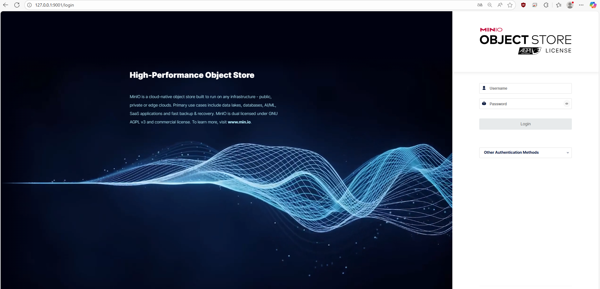

# Visual Workflow
## Access and Login

### 1. JupyterHub Login
Access the platform at `http://localhost:8080` to begin your ML development session.

### 2. User Session Loading
After authentication, the platform prepares your personalized environment.

## Jupyter Environment

### 3. Welcome and Pre-loaded Scripts
Your notebook environment starts with pre-configured scripts and welcome materials.

### 4. Available Extensions
The platform includes integrated extensions for ML tools accessible directly from your notebook.

## ML Tool Integration

### 5. MLflow Extension
Track experiments, log parameters, and manage models through the integrated MLflow interface.

### 6. MLflow Example Code
Example code showing how to track parameters, metrics, and artifacts with MLflow.

### 7. MLflow Interface After Run
The MLflow interface displaying the tracked experiment after code execution.

### 8. MLflow Run Details
Detailed view of an MLflow experiment run with parameters, metrics, and artifacts.

View of saved models.

### 9. TensorBoard Extension
Visualize training metrics and model performance with the integrated TensorBoard interface.

### 10. TensorBoard Example Run
Example of a model training run being visualized in TensorBoard.

### 11. TensorBoard Logs
Training metrics visualized as graphs in the TensorBoard interface.

### 12. TensorBoard Model Graph
Visual representation of the neural network architecture in TensorBoard.

## Database Management

### 13. pgAdmin Access
Manage PostgreSQL databases through the web-based pgAdmin interface at `http://localhost:5050`.

### 14. Database Authentication
Enter database credentials to access your data.

### 15. Database Interface
Navigate and manage database schemas and tables.

### 16. Database Overview
View all available databases in your environment.

### 17. Database Structure
Explore individual database schemas and objects.

### 18. MLflow Database
Access the dedicated MLflow database for experiment metadata.

### 19. MLflow data saved
Access the saved data in the MLflow database.

## Object Storage

### 20. MinIO Console
Manage datasets, models, and artifacts through the MinIO interface at `http://localhost:9001`.

### 21. MinIO Dashboard
Browse and organize your stored data and model artifacts.

### 22. MinIO saved models
Browse saved models in MinIO.

### 23. MinIO saved plots
Browse saved artifacts (plots) in MinIO.

## Workflow Summary

1. **Login** → Access JupyterHub interface
2. **Environment Setup** → Automatic provisioning of notebook with extensions
3. **Development** → Use integrated MLflow and TensorBoard for experiment tracking
4. **Data Management** → Store and retrieve data via MinIO
5. **Database Access** → Query and manage data through pgAdmin
6. **Collaboration** → Share experiments and models across the platform

## Service Endpoints

- **JupyterHub**: http://localhost:8080
- **MinIO Console**: http://localhost:9001
- **pgAdmin**: http://localhost:5050
- **MLflow UI**: Accessible via Jupyter extension
- **TensorBoard**: Accessible via Jupyter extension

This visual workflow demonstrates the complete user experience from initial login through active development and data management.